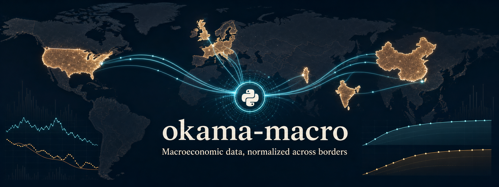

# okama-macro



Macro-economic data-source clients — CPI inflation and central-bank / policy
rates — for the [okama](https://github.com/mbk-dev/okama) project.

One package, one HTTP/DataFrame layer, one dependency. It consolidates the macro
source clients that used to live as separate per-source micro-repos and as
in-repo modules of okama-API, behind a single unified series API. Rationale and
migration history: [mbk-dev/okama-API#41](https://github.com/mbk-dev/okama-API/issues/41)
and its ADR 0001.

## Install

```bash
pip install okama-macro
```

Requires **Python ≥ 3.11**. Runs on both **pandas 2.x and 3.x**.

## Quick start

```python
import okama_macro

okama_macro.list_series()
# ['CHN_LPR1.RATE', 'CHN_LPR5.RATE', 'CNY.INFL', 'EU_DFR.RATE',
#  'EU_MLR.RATE', 'EU_MRO.RATE', 'GBP.INFL', 'HKD.INFL', 'HK_BR.RATE',
#  'ILS.INFL', 'IND_RBI.RATE', 'INR.INFL', 'ISR_IR.RATE', 'UK_BR.RATE',
#  'USD.INFL', 'US_EFFR.RATE']

# A rate as a decimal fraction (3.62% -> 0.0362), observations only:
okama_macro.get('US_EFFR.RATE', first_date='2020-01-01')

# Monthly m/m inflation as a decimal fraction:
okama_macro.get('USD.INFL')
```

## The contract

Every series returned by `get()` obeys the same contract, so callers never
special-case a source:

- **Decimal fractions** — m/m inflation `0.0042`, a rate `0.0525` (never percent,
  never an index level).
- **CPI series** are monthly, stamped on the **first of the month**, derived from
  the source's index via `pct_change()` (base-invariant).
- **Rate series** normally carry **observations only — no padding**. Forward-fill
  to a daily grid on the consumer side if you need one. `UK_BR.RATE` is the
  documented exception: the Bank of England source publishes change dates, and
  the client safely forward-fills them into a daily series.
- **Ascending `DatetimeIndex`**, `float` dtype, and `Series.name == key`.

`get()` raises `ValueError` for an unknown key (listing the known ones);
`list_series()` returns the available keys, sorted.

## Available series

| Key | Series | Country | Source module |
|-----|--------|---------|---------------|
| `USD.INFL` | US CPI, m/m | United States | `fred` (FRED `CPIAUCNS`) |
| `US_EFFR.RATE` | US Federal Funds rate | United States | `fred` (FRED `DFF`) |
| `HKD.INFL` | Hong Kong Composite CPI, m/m | Hong Kong | `censtatd` (HK C&SD) |
| `HK_BR.RATE` | HKMA Discount Window Base Rate | Hong Kong | `hkma` |
| `INR.INFL` | India General CPI, m/m | India | `mospi` (MOSPI) |
| `IND_RBI.RATE` | RBI policy repo rate | India | `bis` (history) + `rbi` (same-day tail) |
| `CNY.INFL` | China CPI, m/m | China | `nbsc` (NBS China) |
| `CHN_LPR1.RATE` | China one-year Loan Prime Rate | China | `cfets` |
| `CHN_LPR5.RATE` | China five-year Loan Prime Rate | China | `cfets` |
| `GBP.INFL` | UK CPIH, m/m | United Kingdom | `ons` (UK ONS) |
| `UK_BR.RATE` | Bank of England Bank Rate | United Kingdom | `boe` |
| `ILS.INFL` | Israel CPI, m/m | Israel | `boi` (Bank of Israel) |
| `ISR_IR.RATE` | Bank of Israel policy rate | Israel | `boi` |
| `EU_MRO.RATE` | ECB main refinancing operations rate | Euro area | `ecb` |
| `EU_MLR.RATE` | ECB marginal lending facility rate | Euro area | `ecb` |
| `EU_DFR.RATE` | ECB deposit facility rate | Euro area | `ecb` |

## Raw per-source clients

Each source also exposes its raw client under `okama_macro.sources.*`, returning
data **as the agency publishes it** (CPI index levels, rates in percent) — use
these only if you need the unnormalised series; prefer `get()` otherwise.

```python
from okama_macro.sources import (
    bis, boe, boi, censtatd, cfets, ecb, fred, hkma, mospi, nbsc, ons, rbi
)

hkma.get_base_rate()          # percent, daily
censtatd.get_composite_cpi()  # CPI index level, monthly
```

## Configuration (environment)

| Variable | Needed for | Notes |
|----------|-----------|-------|
| `FRED_API_KEY` | `USD.INFL`, `US_EFFR.RATE` | Free key from FRED; kept out of logs. |
| `PROXY_HOST`, `PROXY_PORT` | `bis`, `mospi`, `rbi` | Optional outbound HTTP proxy. |
| `PROXY_USER`, `PROXY_PASS` | — | Optional proxy credentials. |

## Architecture

```
okama_macro/
├── __init__.py        # public API: get(), list_series()
├── registry.py        # key -> normalised Series (the contract)
├── _http.py           # shared Session: retry/back-off, proxy, browser UA,
│                       #   legacy-TLS, secret redaction
├── _frame.py          # DataFrame/Series shaping helpers
└── sources/           # one client per source (bis, boe, boi, censtatd, cfets,
                        #   ecb, fred, hkma, mospi, nbsc, ons, rbi)
```

Two layers: thin **sources** (data as published, on the shared `_http`) and a
**registry** that normalises each key to the contract above.

## Development

```bash
poetry install
poetry run pytest        # test suite
poetry run ruff check .  # lint (rules C, E, F, W, B)
```

CI runs the suite and lint on Python 3.11, 3.12, 3.13 and 3.14. `poetry.lock` is
intentionally untracked.

## License

MIT.
